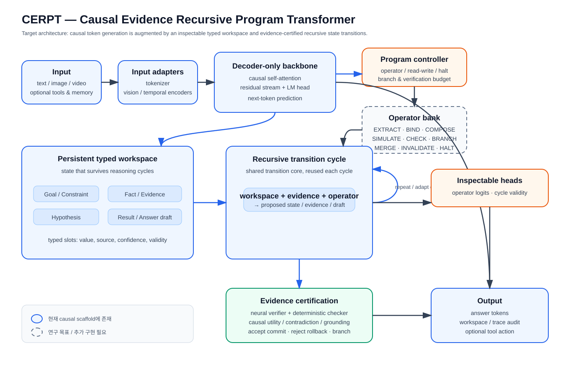
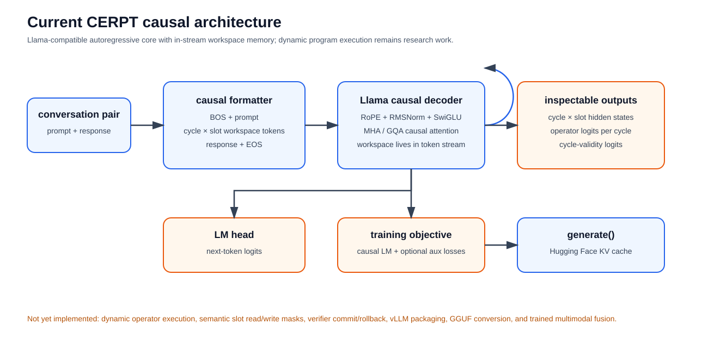
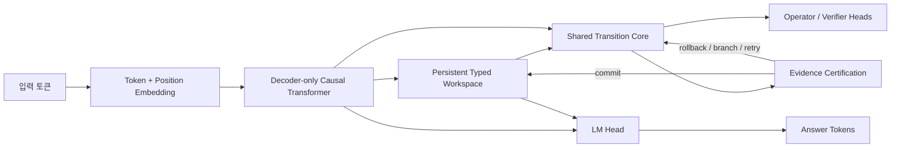

# CERPT

## Causal Evidence Recursive Program Transformer

CERPT는 **decoder-only causal language model**에 **persistent typed workspace**, **재귀적 상태 전이**, **operator program**, **evidence certification**을 결합하려는 연구 아키텍처입니다.

일반적인 Transformer가 residual stream 안에서 모든 중간 상태를 암묵적으로 처리한다면, CERPT는 문제 풀이 중 중요한 상태를 별도의 workspace에 유지하고, 여러 reasoning cycle을 거쳐 제안된 상태를 검증한 뒤 다음 상태로 반영하는 것을 목표로 합니다.

> 이 저장소는 완성된 범용 LLM이 아니라 CERPT 가설을 검증하기 위한 공개 연구 프로토타입입니다. 현재 checkpoint의 자연어 능력이나 CERPT의 우월성은 아직 입증되지 않았습니다.

## CERPT를 한 문장으로 설명하면

**언어 모델이 생성하는 토큰 흐름 옆에 구조화된 작업 기억을 두고, 재사용 가능한 전이 core가 operator를 따라 상태를 갱신하며, evidence와 verifier가 검증한 결과만 답변 생성에 반영하는 causal Transformer입니다.**

## 모델 구조

아래 그림은 CERPT의 연구 목표 구조입니다. 파란색 실선은 현재 causal scaffold에 이미 존재하는 부분이고, 회색 점선은 다음 구현 단계에서 완성할 연구 목표입니다.

<p align="center">
  
</p>

현재 코드가 실제로 실행하는 최소 경로는 다음과 같습니다.

<p align="center">
  
</p>

### 데이터 흐름



### 핵심 모듈

| 모듈 | 역할 | 현재 상태 |
|---|---|---|
| Token backbone | causal self-attention으로 이전 토큰을 보고 다음 토큰 표현을 계산 | 구현됨 |
| Persistent typed workspace | Goal, Fact, Constraint, Evidence, Result 같은 슬롯을 reasoning cycle 사이에 유지 | 최소 workspace 구현됨 |
| Shared transition core | workspace와 입력 evidence를 받아 상태를 반복 갱신 | 구현됨, 현재는 cycle마다 같은 core 재사용 |
| Operator bank / controller | EXTRACT, BIND, SIMULATE, CHECK, BRANCH 등 상태 전이 프로그램을 선택 | head의 logits까지 구현; 동적 실행은 연구 목표 |
| Evidence certification | 새 상태가 유효한지, 모순이 없는지, 실제 성능에 기여했는지 판정 | verifier head와 외부 deterministic verifier 일부 구현 |
| Answer decoder | 최종 상태가 반영된 hidden에서 다음 토큰을 생성 | greedy `generate()` 구현 |
| Vision / video adapter | 이미지·비디오를 workspace에 넣을 수 있는 입력 경로 | encoder bridge 코드 존재; 학습·성능 검증 필요 |

현재 `src/cerpt/models/cerpt_causal.py`에서 forward는 다음 순서로 동작합니다.

1. 입력 토큰과 위치 embedding을 더합니다.
2. causal mask가 적용된 decoder-only Transformer를 통과시킵니다.
3. 학습된 workspace seed를 만들고, token hidden의 요약을 evidence로 사용합니다.
4. 같은 `transition_core`를 `num_cycles`만큼 반복 적용합니다.
5. cycle별 workspace에서 operator logits와 cycle-validity logits를 출력합니다.
6. workspace summary를 token hidden에 더하고 LM head로 다음 토큰 확률을 계산합니다.
7. 학습 시 causal LM loss에 operator·validity 보조 loss를 선택적으로 더합니다.

현재 구현은 **operator 이름을 예측하는 단계**까지이며, 예측된 operator가 실제 typed slot read/write와 rollback을 완전히 실행하는 단계는 아직 아닙니다. 이 차이가 현재 구현과 CERPT의 최종 연구 목표를 구분하는 핵심입니다.

## CERPT가 검증하려는 가설

CERPT의 목적은 “workspace를 넣으면 자동으로 더 똑똑해진다”라고 주장하는 것이 아닙니다. 다음 가설을 동일한 parameter·FLOP·추론 예산에서 baseline과 비교해 검증하려는 것입니다.

- **Persistent state 가설**: 장기 의존성이 있는 문제에서 typed workspace가 latent-only residual stream보다 중간 상태 보존에 유리한가?
- **Recursive transition 가설**: 하나의 transition core를 여러 cycle에 재사용하면 작은 모델도 추가 test-time compute로 정확도를 높일 수 있는가?
- **Evidence certification 가설**: 검증·rollback을 학습시키면 그럴듯하지만 틀린 중간 결과의 commit을 줄일 수 있는가?
- **Operator program 가설**: operator sequence를 사용하면 산수, 코드 trace, 논리, 문서 QA처럼 절차가 다른 작업을 하나의 core에서 분리해 처리할 수 있는가?
- **Parameter efficiency 가설**: 공통 CERPT core와 작은 task/persona adapter를 공유하면 많은 전문 NPC를 각각 큰 모델로 만들지 않고도 특화할 수 있는가?

## 모델 계열과 현재 산출물

| 모델 | 설명 | 판정 |
|---|---|---|
| Legacy CERPT PoC | `CERPTForConditionalGeneration` 기반 encoder–decoder synthetic-task 구조 | 구조 실험용, 범용 LLM 아님 |
| CERPT causal base | from-scratch decoder-only causal LM + workspace + transition core + inspectable heads | 현재 주력 scaffold |
| CERPT Korean SFT | causal base에 한국어 일상 채팅 SFT를 적용한 소형 checkpoint | 동작 확인용, 대화 품질 제한적 |
| CERPT 3B target | hidden 3072, 32 layers, 24 heads, FFN 8192, vocab 32768, context 4096 | 설정만 존재, 아직 학습되지 않음 |
| CERPT multimodal target | text backbone에 vision encoder와 temporal video encoder를 adapter로 연결 | 입력 bridge 구현, 학습·평가 미완료 |

3B 설정은 다음과 같이 약 3.12B parameter로 계산됩니다.

```powershell
python scripts/estimate_causal_params.py --config configs/cerpt-causal-3b.json
```

이는 “3B 모델을 이미 만들었다”는 뜻이 아닙니다. 3B pretraining에는 optimizer state, gradient, activation, checkpoint 저장 공간이 추가로 필요하며, 현재 구현에는 KV cache·FlashAttention·FSDP/DeepSpeed·vLLM backend가 없습니다.

## 학습 전략

CERPT는 한 번의 SFT만으로 완성되는 구조가 아닙니다. 권장 순서는 다음과 같습니다.

```text
대규모 한국어·다국어 causal pretraining
        ↓
instruction / daily chat SFT
        ↓
수학·코드 trace·논리·문서 QA curriculum
        ↓
operator sequence + workspace supervision
        ↓
evidence verifier + deterministic checker + rollback 학습
        ↓
vision / video multimodal alignment
        ↓
task adapter, NPC persona/memory, serving optimization
```

각 단계의 학습 데이터는 달라야 합니다.

- **Pretraining**: 자연어의 문법·어휘·사실 표현을 배우는 대규모 text corpus
- **SFT**: 질문-답변, 지시 따르기, 한국어 일상 대화
- **Reasoning curriculum**: 정답뿐 아니라 중간 상태, operator, evidence, validity label
- **Verifier training**: 맞는 trace와 틀린 trace, counterexample, contradiction, rollback 사례
- **Multimodal alignment**: 이미지·비디오 입력과 설명·질문·근거·행동의 대응 데이터

따라서 현재의 11,000개 한국어 산수·채팅 데이터는 파이프라인과 작은 실험을 검증하는 용도이지, 범용 지식을 습득하기 위한 pretraining corpus가 아닙니다.

## 지금까지 확인된 사실

현재 저장소에서 재현 가능한 결과와 한계를 구분하면 다음과 같습니다.

| 항목 | 결과 |
|---|---|
| 한국어 데이터 | 11,000 records; train 8,803 / validation 1,098 / test 1,099인 `korean_basic_v6` 사용 |
| 데이터 감사 | schema 오류 0, duplicate ID 0, split 간 입력 중복 0, 산수 검증 8,000/8,000 |
| causal base | hidden 64, decoder 1 layer, 10 epochs, validation loss 1.6539 |
| Korean SFT | chat subset 5 epochs, validation loss 0.1099 |
| 산수 동작 | deterministic verifier를 통해 `37 - 8`, `× 4` → `116` 확인 |
| 자연어 대화 | intent 혼합과 반복이 남아 있음; 범용 대화 성능으로 해석하면 안 됨 |
| multimodal | encoder bridge는 있으나 현재 text checkpoint가 이미지·비디오 QA를 학습한 것은 아님 |
| serving | Hugging Face save/load와 greedy generation은 가능; 일반 vLLM/Ollama 호환은 아직 아님 |

검증 명령:

```powershell
pytest -q
python scripts/audit_korean_basic.py --data-dir data/korean_basic_v6
```

## 성능은 어떻게 주장할 것인가

현재는 “CERPT가 DeepSeek보다 좋다” 또는 “작은 모델로 범용 LLM이 된다”고 주장할 단계가 아닙니다. 연구 결과는 아래 지표로 비교해야 합니다.

| 측정 영역 | 핵심 지표 |
|---|---|
| 언어 모델 | validation loss, perplexity, 한국어 QA/요약/대화 정확도 |
| 수학·논리 | exact match, step accuracy, final answer accuracy |
| 코드 trace | 실행 결과 일치율, 오류 위치 탐지율, 수정 성공률 |
| evidence | evidence 제거 전후 성능 차이, grounding score, contradiction rate |
| certification | commit precision/recall, rollback 성공률, false acceptance rate |
| 효율 | parameter 수, peak memory, token/FLOP, cycle 수별 품질 증가 |
| NPC 특화 | persona consistency, long-horizon memory, task success, adapter size |
| multimodal | image/video QA 정확도, temporal grounding, hallucination rate |

최소한 다음 ablation을 함께 공개해야 CERPT 구조의 기여를 말할 수 있습니다.

1. 같은 decoder-only backbone, workspace 없음
2. workspace는 있지만 recursive cycle 없음
3. workspace + cycle, operator supervision 없음
4. workspace + cycle + verifier, rollback 없음
5. 전체 CERPT

모든 비교는 같은 tokenizer, 데이터 split, parameter budget, 학습 token 수, 추론 token/cycle 예산을 사용해야 합니다.

## 멀티모달 방향

CERPT의 멀티모달 설계는 이미지나 비디오를 decoder에 픽셀 그대로 넣는 방식이 아닙니다.

```text
image → vision encoder ─┐
                        ├→ modality adapter → Evidence / Fact workspace slot
video → frame encoder → temporal encoder ┘
text  → tokenizer → causal backbone
```

vision encoder는 모델에 연결되는 입력 구성요소이고, video encoder는 frame feature를 시간축으로 집계하는 구성요소입니다. 다만 연결 코드가 있다고 해서 모델이 자동으로 시각 능력을 획득하는 것은 아닙니다. 실제 능력을 만들려면 image/video QA, caption, temporal grounding, evidence selection 데이터로 alignment와 SFT를 수행하고, text-only 성능 보존 여부를 별도로 평가해야 합니다.

자세한 구현 방향은 [멀티모달 구현 문서](./docs/guides/MULTIMODAL_IMPLEMENTATION.md)를 참고하세요.

## 실행

현재 causal checkpoint를 대화형으로 확인하려면:

```powershell
python scripts/chat_causal.py `
  --model-dir artifacts/cerpt-causal-korean-v6-sft `
  --question "37에서 8을 빼고 4를 곱하면 얼마야?"
```

Mac에서는 학습 launcher를 실행할 수 있습니다.

```bash
chmod +x scripts/train_mac.command
./scripts/train_mac.command
```

`1`은 한국어 chat SFT, `2`는 3B target pretraining 설정을 사용합니다. 3B 옵션은 실제 메모리와 tokenizer를 확인한 뒤 실행해야 하며, 현재 Mac M4 Pro 256GB에서 가능한지와 실제 소요 시간은 sequence length, batch, gradient accumulation, MPS kernel에 따라 측정해야 합니다.

## 저장소 문서

- [CERPT target architecture](./docs/architecture/cerpt-target-architecture.svg)
- [현재 causal 구현 구조](./docs/architecture/cerpt-current-implementation.svg)
- [연구 목표와 성공 기준](./docs/research/01-goals-and-success-criteria.md)
- [연구 가설](./docs/research/02-research-hypotheses.md)
- [시스템 아키텍처 상세](./docs/research/03-system-architecture.md)
- [state와 operator 설계](./docs/research/04-state-and-program-design.md)
- [certification과 verification](./docs/research/05-certification-and-verification.md)
- [학습 전략](./docs/research/06-training-strategy.md)
- [실험·평가 계획](./docs/research/07-experiment-and-evaluation.md)
- [Decoder-only 구현 노트](./docs/implementation/DECODER_ONLY_CERPT_BASE.md)
- [Mac 학습 가이드](./docs/guides/MAC_TRAINING.md)
- [SFT 가이드](./docs/guides/SFT.md)
- [모델 카드](./docs/model-cards/MODEL_CARD_CAUSAL_KOREAN_SFT.md)
- [진행 기록](./docs/progress/)

## 공개 모델

- GitHub: [dkekzhs/cerpt-model](https://github.com/dkekzhs/cerpt-model)
- 공개 개발 브랜치: [mac-mps-sft](https://github.com/dkekzhs/cerpt-model/tree/mac-mps-sft)
- Causal Korean base: [qweqwqw113/cerpt-causal-korean-v5-10](https://huggingface.co/qweqwqw113/cerpt-causal-korean-v5-10)
- Korean SFT: [qweqwqw113/cerpt-causal-korean-v6-sft](https://huggingface.co/qweqwqw113/cerpt-causal-korean-v6-sft)

## DeepSeek-V4와의 관계

DeepSeek-V4처럼 모델을 “입력 → backbone → 중간 모듈 → 출력”의 계층 구조로 설명하고, 구현 상태와 스케일 설정을 함께 공개하는 방식을 참고했습니다. 하지만 CERPT가 DeepSeek-V4의 attention, MoE, residual 구조를 복제한다는 뜻은 아닙니다. CERPT의 연구 대상은 **typed workspace와 evidence-certified recursive computation**이며, 이를 decoder-only backbone에 삽입하는 방법입니다.

이 저장소의 3B 설정은 DeepSeek 계열의 pretrained weight를 가져온 것이 아니라 CERPT causal 모델을 확장하기 위한 from-scratch 설계입니다. 따라서 “검증된 base LLM에 CERPT를 붙였다”가 아니라, 현재는 “CERPT 구조 자체를 작은 모델에서 검증하고 있으며, 이후 충분한 token과 compute로 pretraining해야 한다”가 정확한 설명입니다.

## 라이선스와 연구 주의사항

학습 데이터와 외부 encoder의 라이선스를 각각 확인한 뒤 배포해야 합니다. 이 저장소의 checkpoint는 연구용이며, 현재 수치만으로 의료·법률·안전·상업 의사결정을 수행하도록 권장하지 않습니다.
